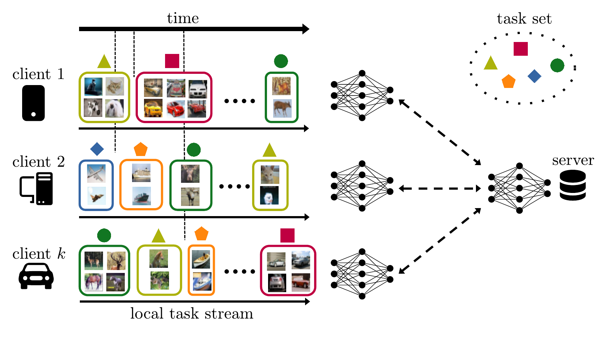
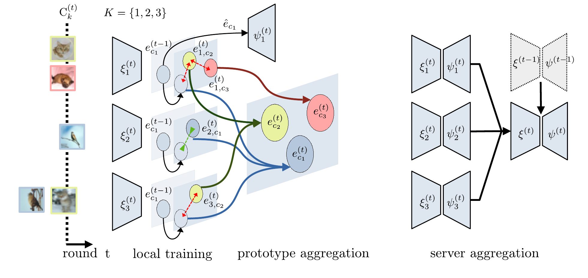

# Asynchronous Federated Continual Learning

<div align="center">

[](https://arxiv.org/pdf/2304.03626.pdf)
[](https://openaccess.thecvf.com/content/CVPR2023W/FedVision/papers/Shenaj_Asynchronous_Federated_Continual_Learning_CVPRW_2023_paper.pdf)
[](media/slides.pdf)
[](#Citation)

</div>


**PyTorch implementation** of: D. Shenaj, M. Toldo, A. Rigon and P. Zanuttigh, “Asynchronous Federated Continual Learning”, CVPR 2023 Workshop on Federated Learning for Computer Vision (FedVision).

**Corresponding author:** donald.shenaj@dei.unipd.it

<div align='center'>


</div>


## Summary

The standard class-incremental continual learning setting assumes a set of tasks seen one after the other in a fixed and predefined order. This is not very realistic in federated learning environments where each client works independently in an asynchronous manner getting data for the different tasks in time-frames and orders totally uncorrelated with the other ones. We introduce a novel federated learning setting (AFCL) where the continual learning of multiple tasks happens at each client with different orderings and in asynchronous time slots. We tackle this novel task using prototype-based learning, a representation loss, fractal pre-training, and a modified aggregation policy. Our approach, called FedSpace, effectively tackles this task as shown by the results on the CIFAR-100 dataset using 3 different federated splits with 50, 100, and 500 clients, respectively.


### Experiments' logging

Make a new [wandb](https://wandb.ai/site) account if you do not have one yet, create a new wandb project and set the `wandb_entity` parameter in the config files.


### Cifar-100 splits

We used 3 strongly non-IID splits with 10 tasks each made of 10 classes, while the total number of clients is equal to 50, 100, and 500. The splits are available [here](https://drive.google.com/drive/folders/1Zuup-gwLOS8kiUab64M2ffW6UFdMBQ9z?usp=drive_link) and should be placed inside a folder called `dataset_splits`. To load a split or to create a new one use respectively the parameters `load_distribution_file` and `save_distribution_file`.

### How to run

In the configs folder, it is possible to find examples of config files for some of the experiments to replicate the
results of the paper. Run one of the exemplar configs or a custom one from the root path of your local copy of the
repository:

```./run.sh [path/to/config]```

N.B. always leave a blank new line at the end of the config. Otherwise, your last argument will be ignored.

<a name="Citation"></a>
## Cite us
If you find our work relevant to your research and you use this repository, please consider to cite:

```
@inproceedings{shenaj2023asynchronous,
  title={Asynchronous Federated Continual Learning},
  author={Shenaj, Donald and Toldo, Marco and Rigon, Alberto and Zanuttigh, Pietro},
  booktitle={Proceedings of the IEEE/CVF Conference on Computer Vision and Pattern Recognition},
  pages={5054--5062},
  year={2023}
}
```
